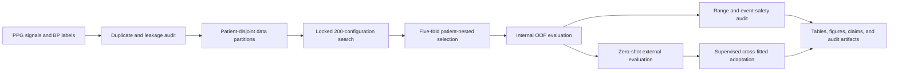

# Patient-Nested Model Selection and Cross-Domain Safety Audit of PPG-Only Blood-Pressure Estimation

<p align="center">
  <b>An auditable, patient-separated evaluation pipeline for PPG-based systolic and diastolic blood-pressure estimation</b>
</p>

<p align="center">
  <a href="1537___37976.pdf">Paper</a> ·
  <a href="FINAL/results/tables/">Result tables</a> ·
  <a href="FINAL/results/figures/">Figures</a> ·
  <a href="FINAL/docs/REPRODUCIBILITY.md">Reproducibility protocol</a> ·
  <a href="FINAL/README_FA.md">راهنمای فارسی</a>
</p>

> **Research-use warning**  
> This repository reports retrospective experiments. It is not a medical device and must not be used for diagnosis, treatment, or patient monitoring.

## Overview

Cuffless blood-pressure estimation from photoplethysmography (PPG) is often summarized using a single average error. That number can hide subject leakage, regression toward the cohort mean, weak performance at clinically important pressure extremes, and failure under domain shift.

This repository accompanies the paper **“Patient-Nested Model Selection and Cross-Domain Safety Audit of PPG-Only Blood-Pressure Estimation.”** It provides the code, locked experiment registries, audit artifacts, result tables, and publication figures for:

- a locked search over **200 model configurations**;
- five-fold, patient-nested evaluation with **1,005 inner fits**;
- duplicate-aware analysis of **1,524 MIMIC-BP subjects** and **45,689 retained segments**;
- pressure-range and high-blood-pressure safety audits;
- zero-shot and supervised cross-fitted evaluation on **119 VitalDB patients** and **2,380 synchronized windows**; and
- secondary transfer analyses on cuff-labelled PPG datasets.

The central finding is deliberately cautious: patient-nested selection improved on a fold-specific training mean, but did not outperform the historical prior, and its errors increased sharply at pressure extremes and under external zero-shot transfer.

## Main results

| Evaluation | SBP MAE | DBP MAE | Interpretation |
|---|---:|---:|---|
| MIMIC-BP, patient-nested selected procedure | **13.08 mmHg** | **8.35 mmHg** | Primary internal estimate |
| MIMIC-BP, historical fixed prior | 13.10 mmHg | 8.32 mmHg | Statistically indistinguishable from the selected procedure (`p = 0.376`) |
| MIMIC-BP, outer-training-fold mean | 14.38 mmHg | 9.63 mmHg | Simple fold-specific baseline |
| VitalDB, model zero-shot | 18.39 mmHg | 11.29 mmHg | Worse than the source-training mean |
| VitalDB, source-training mean | 17.85 mmHg | 10.45 mmHg | Calibration-free baseline |
| VitalDB, supervised affine cross-fit | 16.48 mmHg | 9.25 mmHg | Uses destination-domain labels |

Additional safety findings:

- direct high-BP sensitivity was **0.50%** at **99.98% specificity**;
- high-BP segments had an SBP/DBP MAE of **29.79/17.70 mmHg**;
- zero-shot VitalDB bias was **-11.21/-8.21 mmHg** for SBP/DBP; and
- the model strongly regressed toward central pressure values, producing much larger errors at the extremes.

All values above are read from the committed manuscript and result artifacts. The detailed source tables are available in [`FINAL/results/tables/`](FINAL/results/tables/).

## Figures

### Locked search and patient-nested selection


The left panel summarizes the complete locked screening distribution. The right panel shows the independently selected inner score for each held-out outer fold.

### Error across pressure ranges

FINAL/results/figures/FIGURE_3_RANGE_SPECIFIC_ERROR.png

Aggregate MAE conceals a steep increase in error at high SBP and DBP ranges. The dotted line is the overall tail-error reference used in the audit.

### Bland-Altman analysis


The plots expose pressure-dependent error and the negative bias observed during zero-shot VitalDB transfer.

### External calibration stress test


Supervised affine cross-fitting corrects location and scale, but the shallow slopes indicate limited tracking of between-window pressure variation.

## Study design



The official MIMIC-BP split contains 1,100 training, 195 validation, and 229 test subjects. Development screening excludes the official test partition. In the primary analysis, model selection is repeated inside every outer training fold, with zero patient overlap at both levels and exactly one outer-fold prediction for each retained segment.

## Model search space

The locked registry covers convolutional, residual, recurrent, Transformer, morphology-aware, multiscale, temporal-spectral, and foundation-model variants. It also evaluates:

- raw, filtered, detrended, robust-scaled, derivative, and multiview inputs;
- statistical, spectral, derivative, pulse, and fused engineered features;
- robust regression, concordance, asymmetric high-BP, tail-weighted, and physiological multitask objectives; and
- multiple training and augmentation strategies.

The registered search definitions are stored in [`FINAL/phase2/protocol/`](FINAL/phase2/protocol/). The complete 200-method results and all 1,005 nested inner fits are included under [`FINAL/results/tables/`](FINAL/results/tables/).

## Repository layout

```text
.
├── 1537___37976.pdf          # article manuscript
├── README.md                 # this file
└── FINAL/
    ├── main.py               # single pipeline entry point
    ├── config.yaml           # paths and core experiment settings
    ├── pipeline/             # staged runner, logging, and resume state
    ├── features/             # signal preprocessing and engineered features
    ├── neural/               # waveform cache and transfer model code
    ├── phase2/               # model search, nested CV, safety, and transfer
    ├── scripts/              # audits, tables, figures, and paper builders
    ├── tests/                # repository contracts
    ├── results/
    │   ├── tables/           # publication and supplementary CSV tables
    │   └── figures/          # publication figures in PNG and PDF
    ├── artifacts/            # manifests and audit records
    ├── docs/                 # code scope and reproducibility notes
    ├── data/                 # local data layout and manifests
    └── vendor/papagei/       # required upstream PaPaGei code and license
```

See [`FINAL/docs/CODE_SCOPE.md`](FINAL/docs/CODE_SCOPE.md) for the distinction between the direct manuscript pipeline and preserved exploratory provenance.

## Requirements

- Python 3.11
- a CUDA-capable GPU for the full compute pipeline
- a PyTorch build compatible with the local CUDA driver
- sufficient storage for datasets, caches, checkpoints, and more than one thousand fits
- Tectonic for manuscript PDF generation
- Poppler for PDF inspection
- Git LFS for large checkpoints and arrays

Install the CUDA-compatible PyTorch build first, then install the remaining dependencies:

```bash
cd FINAL
python -m pip install -r requirements.txt
```

The pinned environment snapshot is available in [`FINAL/requirements-lock.txt`](FINAL/requirements-lock.txt).

## Data preparation

The code expects MIMIC-BP-derived PPG arrays and labels, pretrained checkpoints, and the external datasets under `FINAL/data/`. A compact layout is shown below:

```text
FINAL/data/
├── mimic_bp/
│   ├── raw/ppg/              # pXXXX_ppg.npy, shape (30, 3750)
│   ├── raw/labels/           # pXXXX_labels.npy, shape (30, 2)
│   └── splits/               # official patient-disjoint split
├── pretraining/              # forecast and PaPaGei checkpoints
└── external/
    ├── ppg_bp/
    ├── ppg_ambulatory_56/
    └── vitaldb/
```

Read [`FINAL/data/README_FA.md`](FINAL/data/README_FA.md) for exact paths and [`FINAL/DATA_LICENSES.md`](FINAL/DATA_LICENSES.md) before publishing or redistributing any data or model weights.

> Local possession of a dataset or checkpoint does not imply permission to publish it. When redistribution rights are unclear, keep the preparation code, manifests, and hashes in the public repository and omit the restricted files.

## Running the pipeline

From the code directory:

```bash
cd FINAL
python main.py
```

Useful modes:

```bash
python main.py --list-stages
python main.py --dry-run
python main.py --mode compute
python main.py --mode report
python main.py --mode audit
python main.py --from-stage innovation_search
python main.py --force vitaldb_external
```

The runner records each stage in `artifacts/pipeline_state.json`, writes separate logs to `logs/`, validates expected outputs, and can resume completed stages when their code fingerprint and output contracts remain valid.

The full run is computationally expensive: it includes the locked 200-configuration screen, 75 secondary confirmation fits, 1,005 nested inner fits, selected outer-fold fits, external evaluation, reporting, and audits. Use `--dry-run` to inspect the execution order without starting any stage.

## Outputs and traceability

| Location | Contents |
|---|---|
| [`FINAL/results/tables/`](FINAL/results/tables/) | Main and supplementary result tables |
| [`FINAL/results/figures/`](FINAL/results/figures/) | PNG and vector-PDF figures |
| [`FINAL/phase2/outputs/`](FINAL/phase2/outputs/) | Search, confirmation, nested-CV, and external-evaluation artifacts |
| [`FINAL/artifacts/`](FINAL/artifacts/) | Input, leakage, environment, state, and completion audits |
| [`FINAL/logs/`](FINAL/logs/) | Per-stage execution logs |

The pipeline preserves negative results and distinguishes the primary patient-nested estimate from the secondary repeated grouped analysis. Zero-shot evaluation and supervised target-domain adaptation are also reported separately. These distinctions are important to avoid overstating performance.

## Authors

- Mohammad Mahdi Taghsimi
- Amirhossein Arani
- Bahram Tariverdi Zadeh
- Khalil Alipour

University of Tehran, Tehran, Iran.

## Citation

If you use this repository, please cite the accompanying manuscript and the software metadata in [`FINAL/CITATION.cff`](FINAL/CITATION.cff):

```text
Taghsimi, M. M., Arani, A., Tariverdi Zadeh, B., & Alipour, K.
Patient-Nested Model Selection and Cross-Domain Safety Audit of
PPG-Only Blood-Pressure Estimation. 2026.
```

Please also cite the original MIMIC-BP, VitalDB, PPG-BP, ambulatory PPG, and PaPaGei sources when using the corresponding data or pretrained model.

## License and third-party material

The project is currently **all rights reserved** and available for private evaluation only; see [`FINAL/LICENSE`](FINAL/LICENSE). Third-party datasets, papers, code, and model weights remain subject to their original licenses and terms. PaPaGei notices are preserved in [`FINAL/THIRD_PARTY_NOTICES.md`](FINAL/THIRD_PARTY_NOTICES.md) and its vendored license.

Before making a public GitHub release, review [`FINAL/DATA_LICENSES.md`](FINAL/DATA_LICENSES.md), remove any material that cannot legally be redistributed, and use Git LFS only for files that are permitted to be published.
